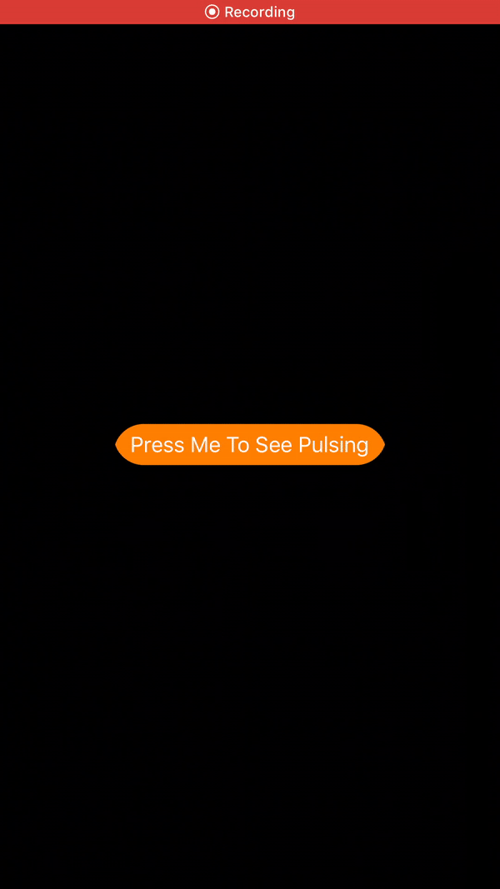

# PulsingButton


# How to use
```
pod "PulsingButton"
```

```swift
		let button = PulsingButton()
		button.translatesAutoresizingMaskIntoConstraints = false
		
		self.view.addSubview(button)
		button.pulsingColor = .orange
		button.centerXAnchor.constraint(equalTo: self.view.centerXAnchor).isActive = true
		button.centerYAnchor.constraint(equalTo: self.view.centerYAnchor).isActive = true
		
		button.setTitle("   Press Me To See Pulsing   ", for: .normal)
		button.layer.cornerRadius = 25
		button.backgroundColor = .orange
	}
```
